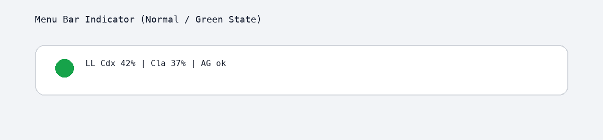
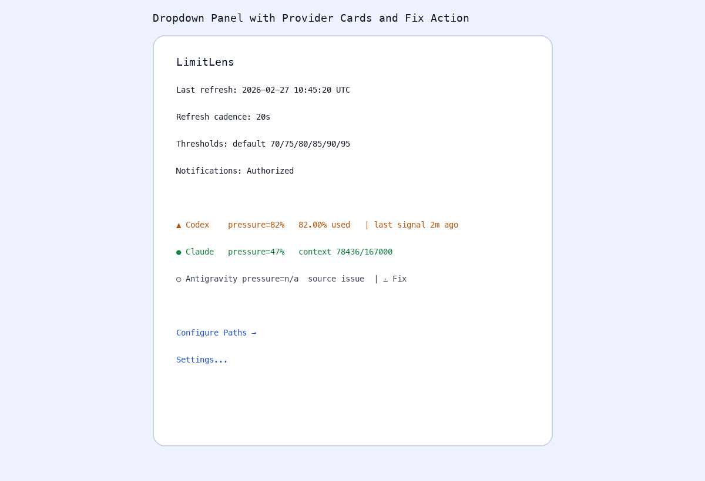
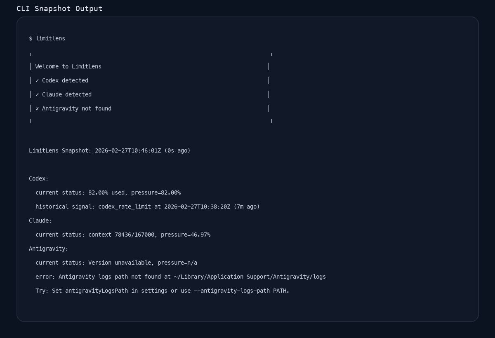
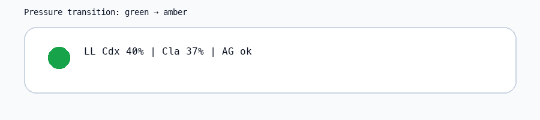

# LimitLens

LimitLens is a processor-agnostic, local-first usage monitor for Codex, Claude, and Antigravity.

It ships as one Swift package with four executables:

- `limitlens` for terminal snapshots and JSON output.
- `LimitLensMenuBar` for always-on macOS top-bar monitoring and alerts.
- `limitlens-core-tests` for parser and threshold unit checks.
- `limitlens-menubar-tests` for launch/notification support checks.

## Visual Overview









## Requirements

- macOS 13+
- Swift toolchain (Command Line Tools or Xcode)

## Build

```bash
git clone https://github.com/darpansmiles/limitlens.git
cd limitlens
swift build
```

## Install

### Local install (universal binaries)

```bash
bash ./scripts/install.sh
```

This builds `arm64` + `x86_64` binaries, merges them, installs CLI commands under `~/.local/bin`, and installs `LimitLens.app` under `~/Applications`.

### Unsigned install fallback

```bash
bash ./scripts/install.sh --unsigned
```

### Signed install

```bash
bash ./scripts/install.sh \
  --sign-identity "Developer ID Application: Example, Inc." \
  --notarize-profile "limitlens-notary"
```

Uninstall:

```bash
bash ./scripts/uninstall.sh
```

Environment doctor:

```bash
bash ./scripts/doctor.sh
```

## CLI Usage

One-shot snapshot:

```bash
swift run limitlens
```

JSON mode:

```bash
swift run limitlens --json
```

Watch mode:

```bash
swift run limitlens --watch --interval 30
```

Override source paths for a run:

```bash
swift run limitlens \
  --codex-path ~/.codex/sessions \
  --claude-path ~/.claude/projects \
  --antigravity-logs-path "~/Library/Application Support/Antigravity/logs"
```

First run prints a boxed onboarding summary once and then persists that completion in `runtime_state.json`.

## Menu Bar App Usage

Launch app:

```bash
swift run LimitLensMenuBar
```

The app appears in the macOS menu bar and provides:

- Severity-colored top-bar status using shared threshold semantics.
- Provider rows with pressure, rate-limit evidence, and source-health markers.
- First-launch welcome block with provider detection and quick path configuration.
- `⚠ Fix` actions for provider source issues that open settings focused on the right path.
- In-app settings for paths, thresholds, notification mode, cooldown, and launch-at-login.

## DMG Packaging

Build a versioned DMG containing `LimitLens.app` and an `Applications` shortcut:

```bash
bash ./scripts/build-dmg.sh --version 0.5.0 --unsigned
```

Signed/notarized DMG flow:

```bash
bash ./scripts/build-dmg.sh \
  --version 0.5.0 \
  --sign-identity "Developer ID Application: Example, Inc." \
  --notarize-profile "limitlens-notary"
```

Output file pattern: `dist/LimitLens-<version>.dmg`.

## Homebrew

Published tap commands:

```bash
brew tap darpansmiles/limitlens
brew install darpansmiles/limitlens/limitlens
brew install --cask darpansmiles/limitlens/limitlens-app
```

If your environment cannot elevate to `/Applications`, install the cask into user space:

```bash
brew install --cask --appdir="$HOME/Applications" darpansmiles/limitlens/limitlens-app
```

Tap assets are maintained from this repo under `packaging/homebrew`.

## Unit Tests

Core parser and threshold checks:

```bash
swift run limitlens-core-tests
```

Menu support lifecycle/notification checks:

```bash
swift run limitlens-menubar-tests
```

## Settings and Permissions

Settings are stored in:

- `~/Library/Application Support/LimitLens/settings.json`
- `~/Library/Application Support/LimitLens/runtime_state.json`

Runtime permissions and OS integration:

- Notifications permission is required for banner-based alerts.
- Local file access to provider paths is required for usage extraction.
- Launch-at-login uses a user LaunchAgent (`~/Library/LaunchAgents/com.limitlens.menubar.plist`).

Defaults:

- Thresholds: `70/75/80/85/90/95`
- Launch at login: enabled
- Notification mode: `sound+banner`

Runtime command-based provider extensions are supported via `externalProviders`. For safety, external command execution is disabled by default and must be explicitly enabled.

## Extending Providers

Provider architecture is incremental. New providers can be added either as native adapters or as runtime command providers without redesigning core entities.

- Extension guide: [`docs/adding-providers.md`](./docs/adding-providers.md)

## Contributing

See [`CONTRIBUTING.md`](./CONTRIBUTING.md).

## License

MIT. See [LICENSE.md](./LICENSE.md).
